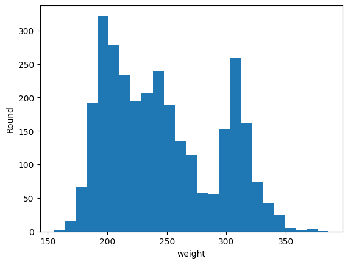
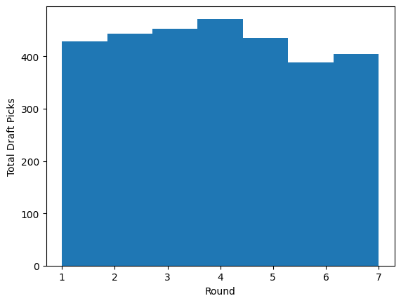
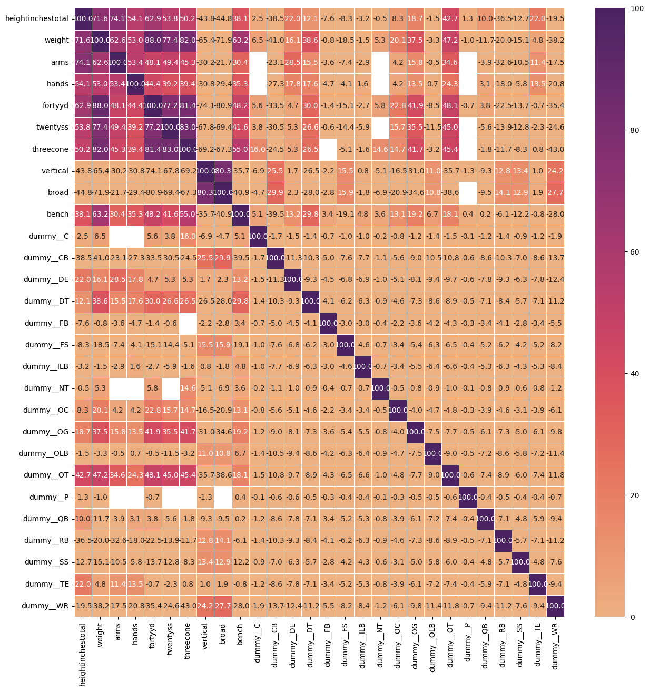
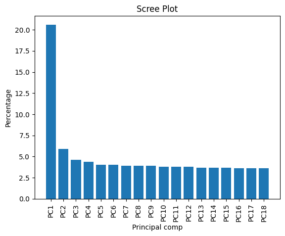
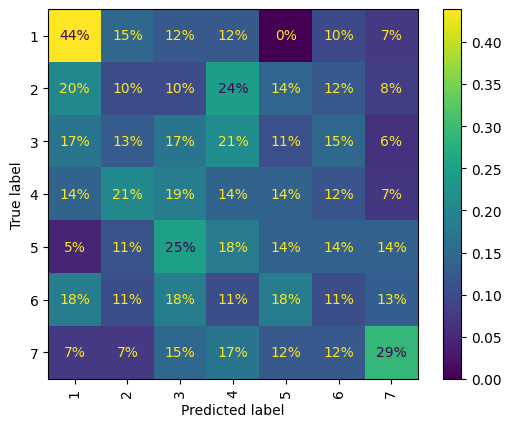

# Will Davis - IA651 Applied Machine Learning - Final Project - Summer 2024

## Description

In this project, I have attempted to use various machine learning techniques to model and predict the NFL Draft based on the performances of NFL Combine participants. More specifically, I am attempting to determine the round each participant will be drafted in. This data was collected during the NFL Combine from 1999 to 2015. The data used in this project comes from [NFLSavant](https://nflsavant.com/about.php), and includes the following fields:

- year - The year the individual particpated in the NFL Combine.
- name - The full name of the participant.
- firstname - The first name of the participant.
- lastname - The last name of the participant.
- position - The position the participant plays (QB, RB, CB, etc.).
- heightfeet - The height of the participant, in feet (floored).
- heightinches - The height of the participant, in inches (inches beyond floored heightfeet).
- heightinchestotal - The height of the participant, in inches (overall height).
- weight - The weight of the paticipant, in pounds.
- arms - The length of one arm of the participant, in inches (assumed to be the longer arm).
- hands - The length of one hand of the participant, in inches (assumed to be the longer hand).
- fortyyd - The 40-yard dash time of the participant, in seconds.
- twentyyd - The 20-yard split time (during 40-yard dash) of the participant, in seconds.
- tenyd - The 20-yard split time (during 40-yard dash) of the participant, in seconds.
- twentyss - The 20-yard shuttle time, in seconds.
- threecone - The 3 cone drill time, in seconds.
- vertical - The vertical jump height, in inches.
- broad - The broad jump length, in inches.
- bench - The count of bench presses (225 lbs.).
- round - The round the participant was drafted in the NFL Draft.
- college - The college the participant played at in the previous year.
- pick - Combination of 'round' and 'pickround', with format 'round(pickround)'.
- pickround - The in-round pick number for the participant in the NFL Draft.
- picktotal - The overall pick number for the participant in the NFL Draft.
- wonderlic - Wonderlic Contemporary Cognitive Ability Test score, out of 50.
- nflgrade - Undetermined rating of participant. This was not explained at the data source, and was considered accordingly.

The NFL is immensely popular and generates billions of dollars across many industries annually. The ability to use NFL Combine data to predict the best round in which to draft a college prospect would not only give an NFL team an advantage on the field, it would be applicable in sports betting, determining sportting sponsorships, and many other tangential business opportunities. 

## Process Overview

This project began with exploration of the data, and subsequent data clensing and structuring once I understood the available data points. This included some small research into the NFL Combine itself, determing how each data point is collected, and visualizing the data.

I then explored the relationships between by independent variables and the dependent variable 'round', as well as the relationships between the independent variables themselves. This included generating a correlation matrix, as well as conducting principal component analysis (PCA) to determine feature importance and potentially reduce the number of features needed for modeling.

Finally, I used various machine learning predictive modeling techniques in an attempt to find an optimal model to predict the dependent variable 'round'.

This process was not without its issues, particularly the sparseness of the data. During my work I learned that NFL Combine participants are free to choose which events to participate in, and many do not participate in all of the possible events. This resulted in a lot of missing information in the data set, which needed to be adressed in my approach to this project. The solution I implemented was modeling with and without imputation of the missing values, and comparing the results.

Ultimately, the best model proved to be a support vector machine approach using cross-fold validation and grid search for hyperparameter tuning. As discussed further on, this model did not hold up when introduced to new data. It is likely overfit.

## Exploratory Data Analysis
 
 As mentioned, the dependent variable in thei project was the 'round' feature. There are 7 rounds in the NFL Draft, and consequently the 'round' feature had a range of 1 to 7. I used all of the available features as independent variables, except for 'year', 'name', 'firstname', 'lastname', 'twentyyd', 'tenyd', 'college', 'pick', 'pickround', 'picktotal', 'wonderlic', and 'nflgrade'. The year should be irrelevant for a player's draft positioning, if the player is drafted based solely on their performance during the NFL Combine. There is an argument to be made that the draft strategies and priorities of NFL teams changed from 1999 to 2015, but this is beyond the scope of the question I set out to answer. The name of the player obviously has no predictive value. The 20-yard and 10-yard splits are a subset of the 40-yard dash time, and could be dropped without losing any predicitve information. The college could have some predictive use, but I chose not to use this feature as it added a lot of complexity to my approach. I discuss this further later on. The 'pick', 'pickround', and 'picktotal' features are differing forms of the dependent variable 'round' and as such were not used. The 'wonderlic' and 'nflgrade' features were forms of analysis previously applied to each participant, and I chose to use only pure metrics in this work.

 The problem I am solving here is a classification problem, as there are 7 discrete rounds in which an NFL Combine participant could be drafted in. After cleaning the data, I had 3,026 NFL Combine participants to work with. The hope is that these participants are a good representation of all football players that have been and will be drafted into the NFL. The number of observations is also much larger than the number of features, which is preferable.

 The independent variables were mostly normally distributed. There is an argument to be made that some showed some skewing to the right or left, but not enough that I was concerned. There was one interesting case in which 'weight' was clearly bimodal:

 

I believe that this shows a clear distinction between the offensive/defensive linemen and the rest of the players. They tend to be much bigger, and it was interesting to see that visualized.

Predictably, the distribution of the dependent variable 'round' was fairly uniform (same number of draft picks in each round of the NFL Draft):

There is some variability between rounds here, and that is due to a number of factors. The NFL Draft does not have exact uniformity when it comes to the number of draft picks in each round, with compensatory draft picks, forfeited draft picks, and other changes happening before the NFL Draft starts. Generally, each round will have 32 picks though, one for each NFL team.

While most of my data was numerical, there was one feature 'position' that was categorical. As this field was low-cardinality, I was able to dummy encode the various positions for use in the machine learning techniques that I implemented. This also allowed me to incorporate the 'position' feature into the following correlation matris:

There was a decent amount of correlation between the NFL Combine events and measurements, but less so between these metrics and the dummy encoded positions. There was a strong enough case for the correlations between the non-positional metrics that I incorporated PCA into my procedure. This resulted in the following scree plot:

As evidenced, the first principal component explained over 20% of the variance in the data set. The proportion of variance explained by each of the following principal components dropped significantly after this initial component. While I used the results of this PCA for modeling, I could have gone further and determine the original feature importance in an attempt to reduce the number of original features used in subsequent modeling. I discuss this in more detail later.

## Model Fitting

For each model I fit to my data, I started the process by using a train-test split of 90% to 10%. This was achieved using the train_test_split module from the sklearn.model_selection library. To ensure that this train-test split was standard for each model and the results were reproducable, I used the same random state (42). There should be no risk of data leakage, the training and test data for each model was split before any other steps were taken in the modeling process.

The modeling techniques I implemented in this project were logistic regression, support vector machine, decision tree with and without bagging, random forest, and voting classification. All of these models were cosen because they are classification machin learning techniques. I also wanted to cast a wide net, because I was unsure which techinque might provide the best results. 
Additionally, I used cross-validation and grid searching during my application of support vector machine classification. This should have been applied to other techniques, which I will discuss later.

Validation metics included accuracy, precision, recall, and F1 score. As the dependent variable 'round' was fairly uniform, I weighed overall accuracy as the most important metric here. I still checked the other metrics just to get a deeper understanding of the performance of the model. I also generated a confusion matrix for each model in an effort to understand the misclassifications in each model. This is the confusion matrix for the most accurate model overall, using support verctor machine classification (in terms of training data):

As we can see, the model was not very good when introduced to the test data. The overall accuracy was reduced to around 20%. This shows a clear overfitting problem, even with scaling, cross-validation, and grid searching.

I have provided some predictions here using two player's data from the 2014 NFL Draft, the number 1 overall pick and the 255 overall pick:

Predicted outcome for number 1 pick: 1st round, correct!
`
predict                1.00
Name: 36, dtype: float64
`

Predicted outcome for number 255 pick: 3rd round, incorrect!
`
predict                3.0
Name: 95, dtype: float64
`

Let's try using values from this year's number 1 pick and number 257 pick:

Predicted outcome for number 1 pick (2024): 6th round, incorrect! Caleb Williams did not do any of the drills!
`
predict                6.0
Name: 95, dtype: float64
`

Predicted outcome for this year's number 257 pick: 3rd round, incorrect!
`
predict                3.0
Name: 95, dtype: float64
`

My advice for the deployment of this model is just don't! It's not good! If it were, it could be used to help an NFL team get the most value out of their draft picks. It could also be used to make a lot of money sport betting.

## Going Further

There were a couple of items I mentioned that could use further exploration. I thinki that I could have likely reduced the number of features used in the modeling if I had dug into the results of my PCA further. I am not sure that I would have had better results, but it is worth looking into it. Also, I should have used more hyperparameter tuning when applying the random forest approach while modeling. I simply ran out of time to add more to the project.

Overall, there is a reason that NFL teams miss on a lot of these draft picks every year. Trying to quntify the abilities of a prospective NFL player is extremly hard to do. There are many qualiities like toughness, intelligence, leadership, and others that just can't be quanitified. There is going to be a certain amount of error from this. I think if I were to attempt this process again, I would use more predictors than just the results of the NFL combine. I think there is a reasonable model to be found here, it just needs more refinement.

